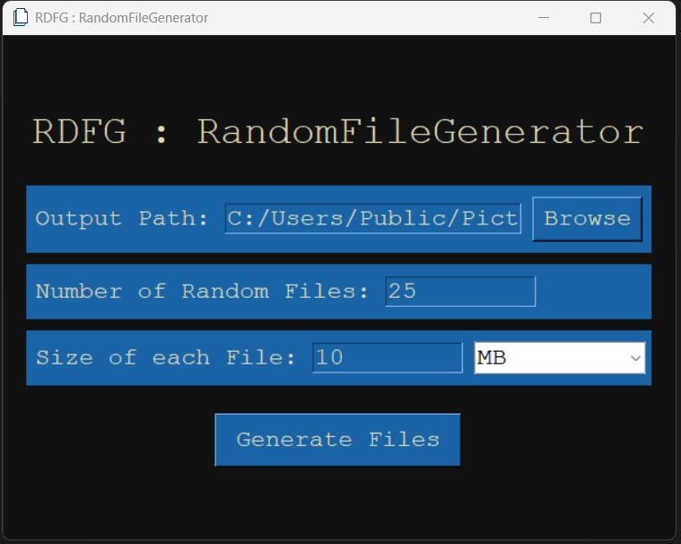
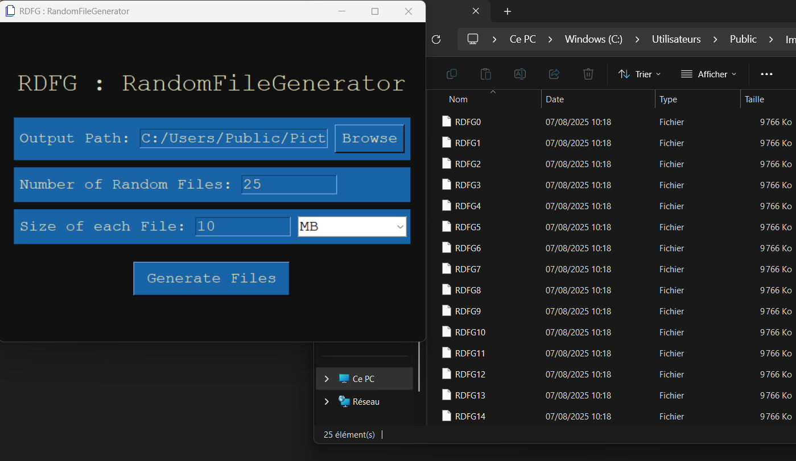

# RDFG : RandomFileGenerator

Easily generate random files in any directory.

## Screenshots




## Installation

Simply run :

```bash
main.py
```
Or download the binary release.

## Features

- Graphical User interface
- Customizable OutputPath and default one
- Size, extension and
  number of files customizable
- Will generate (.bin) files

